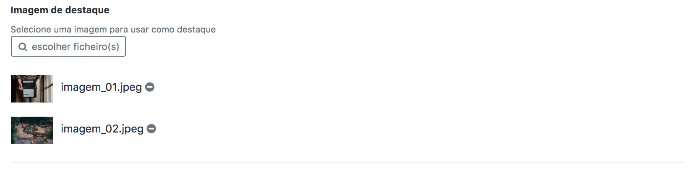
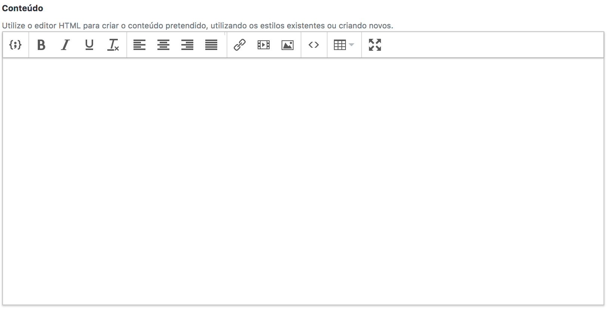
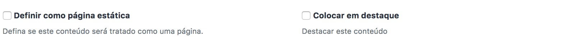
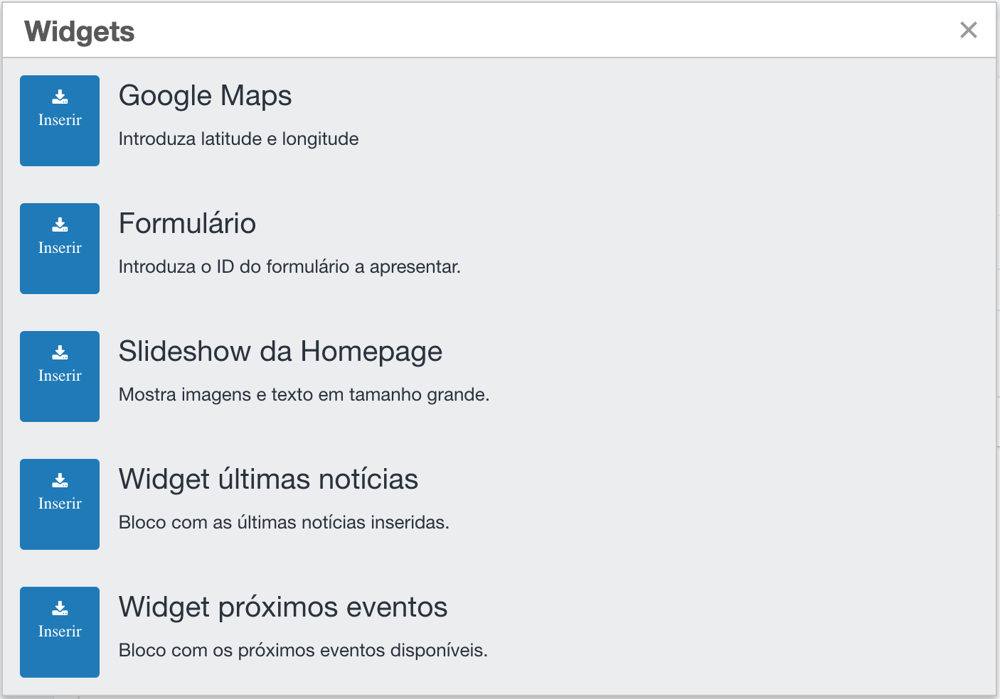
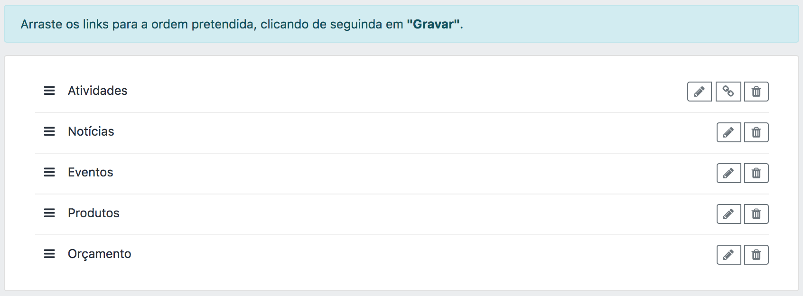

# CMS

Guia de utilização rápida e configuração do módulo CMS na plataforma GetcodeBusiness

# Regras

---

O módulo CMS permite executar as seguintes operações:

- Gestão de conteúdos
- Categorização de conteúdos através de *tags*
- Gerir a navegação da plataforma.

## Routes

# Posts

---

A listagem de conteúdos, posts e páginas encontra-se no *backoffice* no seguinte endereço: `http://{colocar o seu domínio}admin/posts`

## Detalhes

**Imagem de destaque**
Cada conteúdo, seja post ou página, consoante o layout do projeto pode ou não ter uma imagem de destaque que é apresentada no topo da página. Quando seleciona mais do que uma imagem, este irá criar uma galeria (quando disponível no layout).

**Título**
Este campo representa o **nome** da página ou post que está a ser criado. É também identificativo do url da página.

**Conteúdo**
Este campo representa o **conteúdo** do post a ser criado. Pode ser adicionado em formato HTML ou texto simples, com ferramentas de edição de texto e gestor de ficheiros.

## Definições

**Estado**
O estado irá definir a visibilidade do *post* na página. 
Por defeito é gravado como: `publicado` 

**Data de publicação**
Campo para definição da `data de publicação` do *post.* Caso não seja preenchido, este será a data atual da publicação.

**Restringir Acesso**

Selecione um tipo de visitante que pode aceder ao conteúdo. Por defeito todos os conteúdos são públicos, só necessita de alterar caso pretenda bloquear o acesso ao mesmo.

**Tags**
Para categorização de conteúdos. 
Cada conteúdo pode ter mais do que uma `tag`, sendo que serão estas que vão definir a forma de publicação do conteúdo e apresentação do mesmo na página.

**Página estática**
Caso ao post seja atribuído o parâmetro de `página estática`, este será tratado como uma página, não sendo listado nas listagens de conteúdos específicos, como notícias.

**Destaque**
Quando preenchido, este campo define a visibilidade do post em áreas especificas da plataforma. Este é um parâmetro que sobrepõe a ordem das listagens de conteúdos.

Ex.: Notícia destacada para a secção de noticias na *homepage*, será o primeiro item da listagem em relação aos restantes conteúdos.

**SEO**
Campos para definição do `meta-title` e `meta-description` utilizados para as definições de SEO. Caso não preencha, a plataforma irá utilizar o título e a descrição do conteúdo para popular estes campos.

Mais informações sobre conteúdo de metatags no seguinte link: [https://support.google.com/webmasters/answer/79812?hl=pt](https://support.google.com/webmasters/answer/79812?hl=pt)

**Avançado**

A tab de informação *Avançado* apresenta dois campos com editores de código que permitem efetuar alterações de fundo na página sem ser necessário um update.

- `CSS` Permite inserir componentes de folha de estilo que serão apenas válidas para este conteúdo. O formato é o comum de CSS.

    p{
    	font-size: 13px;
    }

Desta forma poderão ser alterados os formatos por defeito do website, como por exemplo o tamanho dos parágrafos, cabeçalhos ou outras definições de estilo avançadas.

- `Javascript` Conteúdo na linguagem de programação Javascript a ser adicionado em conteúdo específico. Este pode ser de várias origens e objetivos, como por exemplo código obtido em sites externos para medição de métricas como o Google Analytics ou outros do género. * **atenção** * ao usar esta opção poderá criar erros de visualização no conteúdo. Caso isso aconteça sugerimos que remova o que adicionou até voltar a visualizar o conteúdo corretamente.

## Widgets

Blocos de código pré-selecionado que permitem obter funcionalidades na página de forma configurável.
Cada projeto contêm os seus blocos, sendo alguns generalistas.

- **Google Maps**
Permite uma inserção de um mapa do Google Maps, indicando a Latitude e Longitude do ponto que se pretende marcar.

# Navegação

---

Disponível no *backoffice* em: `http://oseudominio.pt/admin/menus`

Neste ecrã são apresentados os **menus** disponíveis para o projeto. Estes representam os itens de navegação da plataforma para o visitante.

Os **menus** podem ter definida a sua `posição`. Sendo o layout pré-configurado, é possível definir menus em vários blocos do mesmo.

Ex.: Menu de navegação no cabeçalho, menu lateral na listagem de conteúdos, etc.

Um menu pode ser adicionado a uma Tag, e dessa forma o menu so irá surgir onde essa tag existe. Este comportamento acontece quando existem menus laterais dentro de conteúdos, onde pretendemos associar apenas a determinada categoria.

Ao clicar em `links associados` vamos obter a lista de itens que correspondem ao menu selecionado.

**Links associados**
Através desta tabela poderá adicionar ou editar quaisquer número de itens que representem o seu menu.
Estes podem ser arrastados na vertical de forma a permitir a ordenação pretendida. Para a criação de sub-menus de um menu, deve arrastar os sub-menus para a direita do link principal

Ao adicionar um novo elemento são lhe apresentadas várias escolhas para preenchimento:

- `Pertence a menu` Esta seleção permite mudar a que menu irá pertencer o item que estamos a selecionar
- `Título` O nome visível do item de menu na página
- `Destino` Selecionado a opção **Links** o sistema apresenta todos os itens disponíveis da plataforma para onde o item pode ser apontado. Poderá também selecionar manualmente um endereço no formato: "**http://dominio_de_destino.pt**"
- `É um submenu de:` No caso de querermos que este item seja um subitem de outro, selecionamos aqui a que item pertence.
- `Classe de Css` Condição opcional de desenvolvimento que permite associar este item a uma classe de CSS na folha de estilos, diferente da selecionada. A ser usado apenas em desenvolvimento.
- `Estado` Define se o item está visível ou não consoante a opção selecionada.
- `Parâmetros` Condição de programação para parametros a configurar. A ser usado apenas em desenvolvimento.

# Tags

---

Disponível no *backoffice* em: `http://oseudominio.pt/admin/tags`

***Tag*** é uma das taxonomias predefinidas nesta plataforma.
Pode adicionar *tags* aos seus conteúdos. Pense neles como palavras-chave usadas para tópicos discutidos e categorizados em um conteúdo específico.
No entanto, as *tags* não são adicionadas automaticamente a um conteúdo, a menos que o utilizador as adicione, o que as torna completamente opcionais.

Exemplo: um post sobre um Evento específico pode ter, opcionalmente, *tags* como Evento, Lisboa, Notícia.

Quando um visitante clica em uma *tag*, ele é levado para uma página onde todas os conteúdos com essa tag são listados. 

As taxonomias fornecem uma maneira fácil de classificar o conteúdo em tópicos. Isso ajuda os editore a organizar seu conteúdo e aos visitantes a encontrar os tópicos em que podem estar interessados.

## **Detalhes**

Preencher o campo **Título**.
Definir se o item pertence uma `tag` já existente, definindo-a como uma *subtag*.
O corpo da tag é produzido utilizando o campo **Descrição** onde é possível adicionar imagens, html, vídeos entre outros conteúdos

## **Definições**

Configuração das definições da *tag*, onde podem ser configurados os seguintes campos:

- `Imagem`  a ser usada como destaque.
- `Limite de conteúdos visiveis` define o numero de conteúdos relacionados visíveis em secções pré-definidas.
- Redes Sociais, onde podem ser definidas várias ligações ás redes sociais, tendo como opções o `facebook`, `youtube`, `flickr`, `twitter` e o `instagram`.
- Definição dos campos `meta-title` e `meta-description`, utilizados para as definições de `SEO`. Caso não preencha, a plataforma irá utilizar o título e a descrição do conteúdo para popular estes campos.

# Ficheiros

---

Existem duas categorias de ficheiros no sistema:

- `imagens` (de qualquer formato com pré-visualização. Ex: Png, Jpg, etc)
- `anexos` (ficheiros sem pré-visualização. Ex: Doc, Xls, Pdf etc)

Recomendações para upload de ficheiros:

- Tamanho inferior a 5Mb para o caso de imagens;
- Evitar nomes de ficheiros compridos;
- Não enviar executáveis (ex: .exe);
- Imagens para pré-visualização com resoluções inferiores a 2000px;

Apesar de permitir resoluções maiores, para o bom funcionamento e rapidez da plataforma é recomendado optimizar as imagens antes de as disponbilizar ao público. 

Para comprimir imagens e PDF's recomenda-se os seguintes serviços online:
[https://tinypng.com/](https://tinypng.com/) (jpg e png)
[https://smallpdf.com/compress-pdf](https://smallpdf.com/compress-pdf) (ficheiros PDF)

**Inserir ficheiros ou links em conteúdos**

No editor Html, para adicionar links de ficheiros na página selecione o ícone `url` e no ecrã seguinte selecione a opção de `procurar ficheiro`. Esta ação vai abrir o navegador de ficheiros, listando todos itens que são do tipo `anexo` ou `imagens`. 
Após selecionado será colocado o caminho para o mesmo no *input* do `url`.

Para imagens, no editor Html, selecionar o ícone `imagem` que irá abrir o ecrã de navegação de imagens. Seleciona um item para que seja inserido dentro do conteúdo do editor.

No caso dos conteúdos com destaques de imagens, o ecrã de navegação de ficheiros está também disponível no botão `escolher imagem`

Neste ecrã de navegação de ficheiros é possível além de enviar novos para o repositório da plataforma, remover os existentes clicando no ícone `remover` na lateral à direita do nome do ficheiro. Esta ação remove a entrada da base de dados e da respetiva pasta do sistema.

Atenção: Se já tiver este ficheiro disponível em algum conteúdo, ao remover ficará sem acesso ao mesmo.