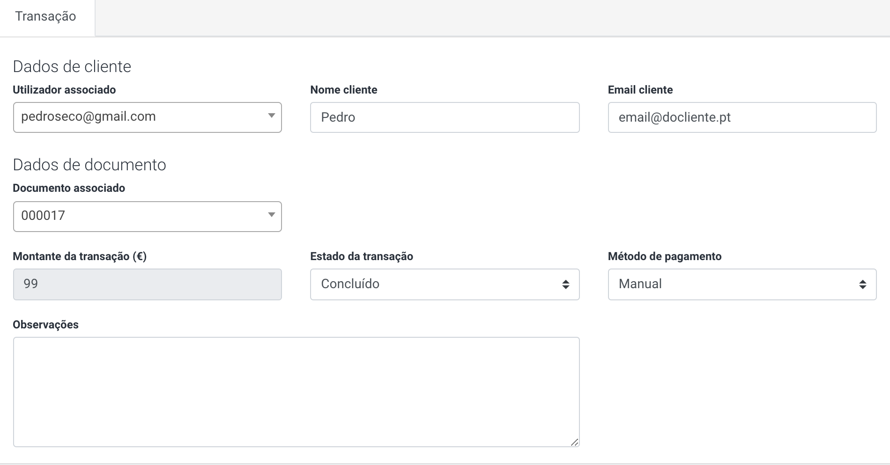
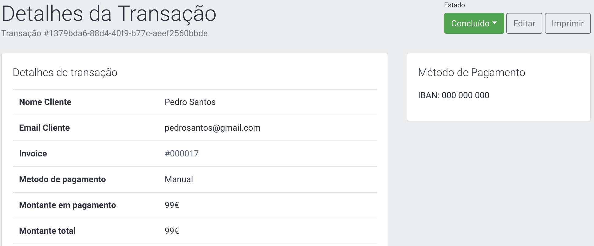

# Pagamentos

# Documentos

---

> Um documento é onde constam informações como descrição de um item comprado, quantidade, preço, forma de pagamento, etc.

A listagem de documentos encontra-se no *backoffice* no seguinte endereço: `http://{colocar o seu domínio}/admin/documentos`

**Operações nos Documentos**

Para criar um documento, clicar em `Criar documento` na barra de ações do histórico de documentos em `Menu > Pagamentos > Documentos`.

- As opções do documento definem as condições da criação de uma transação de acordo com o valor total calculado dos items do documento.

  Selecione a opção **`Enviar email ao cliente ao criar o documento`**, é enviado um email automático para o email inserido com uma cópia do documento.

- O items dos documentos são linhas singulares que representam um item com uma relação de preço/quantidade, como por exemplo um produto.

  Adicione um item e/ou produto ao seu documento, para isso basta clicar em `adicionar linha` na respectiva secção.

A consulta de um documento no *backoffice* é efectuado no seguinte endereço:
`http://{colocar o seu domínio}/admin/documento/{ID}`

Por defeito, um documento é criado com o estado `Por pagar`.

**Registar um pagamento**

Apesar de na ação de criação de um documento ser criada automaticamente um transação com o valor total do mesmo, podem ser adicionados pagamentos parciais.

Para registar um pagamento, clique em `Pagamento` no canto superior direito.

Parâmetros de registo de um pagamento:

- Quando o valor reprensenta a o valor total do documento, e o estado é definido como pago, o estado do documento é alterado para `Pago` e a transação é inserida com o estado `Pago`;
- Quando o valor é inferior ao valor total do documento, é criada uma transação parcial, onde o pagamento da mesma não provoca a alteração do documento.

Um registo de pagamento poderá falhar quando:

- Já existe uma transação pendente com o método de pagamento selecionado.
- O documento associado é dado como pago no decorrer do registo,

**Editar um documento**

A edição de um documento no *backoffice* é efectuado no seguinte endereço:
`http://{colocar o seu domínio}/admin/documentos/update/#/documento/{ID}`

O documento pode ser editado para alterar os seguintes campos:

- Informação do cliente
  - `Nome`, `Email`, `Nif` , `Telefone`, `Morada`, `Localidade`, `Código Postal`
- Opções do documento
  - `Tipo de documento`, `Método de pagamento`, `Template`, `Validade do documento`
- Items do documento
  - `Título`, `Preço`, `Quantidade`, `Taxas`, `Desconto`, `Notas`

# Transações

---

> Uma transação é um acordo entre duas ou mais partes para a transferência de valores.

O histórico de transações encontra-se no *backoffice* no seguinte endereço: `http://{colocar o seu domínio}admin/transacoes`

Estas representam pagamentos que foram efetuados ou estão pendentes de confirmação, os quais pertencem a um documento anteriormente gerado.

**Operações nas Transações**

A edição de uma transação no *backoffice* é efectuada no seguinte endereço:
`http://{colocar o seu domínio}admin/transacoes/edit/{ID}`

Uma transação pode ser editada para alterar os seguintes campos:
`Utilizador associado
Nome e Email do cliente
Documento associado
Obervações`

**Alteração do Estado da Transação**

Quando um pagamento é efetuado através de um método *offline*, como por exemplo uma transferência bancária, será necessário alterar o estado da transação manualmente.

Esta ação está disponível no canto superior direito no ecrã de detalhe da transação, em `Estado`

Para uma transação, são disponibilizados os seguintes estados:

- `Por pagar`
- `Concluído`
- `Anulado`

Ao alterar o estado da transação para `Concluído` o sistema vai dar a transação como paga bem como o respetivo documento SE o valor da transação for igual ao saldo do documento.

Quando um pagamento é efetuado através de um método *online*, o sistema recebe o `status` das transações em tempo real, sempre que existe uma confirmação de pagamento.

No caso de o documento estar associado a um registo ou encomenda, a alteração do estado da transação para `Concluído` irá também alterar o estado do registo/encomenda para um estado de confirmação de pagamento.

Uma transação poderá falhar quando:

- A plataforma encontrar um erro interno;
- A transação exceder um limite de recursos;
- Muitas modificações simultâneas forem tentadas no mesmo grupo de entidades;

# Orçamentos

---

> Orçamento é o nome dado para a avaliação ou cálculo especulativo do custo do serviço a ser prestado

## Pedidos de orçamento

O histórico de orçamentos encontra-se no *backoffice* no seguinte endereço: `http://{colocar o seu domínio}admin/orcamentos`

Estes representam pedidos de orçamento que foram efetuados.

**Operações nos orçamentos**

A consulta de um orçamento no *backoffice* é efectuada no seguinte endereço:
`http://{oseudomínio}/admin/documentos/update/#/documento/orcamento/{ID}`

Após a receção de um pedido de orçamento, a resposta é uma conversão de um orçamento para um documento, onde estão representados todas as informações relativas e items/produtos associados.

Para criar um documento através de um pedido de orçamento, clique em `Criar documento`.

## Formulários de Orçamento

O histórico de formulários de orçamento encontra-se no *backoffice* no seguinte endereço: `http://{colocar o seu domínio}admin/formularios-orcamento` ou em `Menu → Orçamentos → Formulários de orçamento`

A criação de um formulário de orçamento requer o preenchimento de campos como o `titulo`, associar um `formulário` existente e `descrição`.

Caso o campo `URL customizado` seja preenchido, após ser submetida uma resposta a um pedido de formulário, o utilizador seja redirecionado para uma página especifica.

O formulário permite, que caso existam produtos criados, estes sejam associados a um formulário de pedido de orçamento.

Os formulários de orçamento são disponibilizados mediante a necessidade do utilizador, sendo aplicáveis exclusivamente de forma técnica.

# Métodos de pagamento

> Os Métodos de pagamento permitem que sejam disponibilizadas formas de efectuar os pagamentos criados pela plataforma.

A lista de métodos de pagamento encontra-se no *backoffice* no seguinte endereço: `http://{colocar o seu domínio}admin/metodos-pagamento`

Para a criação de um novo método de pagamento, existem alguma parametros de preenchimento a ter em conta:

- `Título` Nome do método
- `Descrição` Descrição a ser usada no frontend na página de pagamentos
- `Nome` técnico Nome da configuração, por exemplo: Omnipay
- `Parâmetros` Parâmetros do método em formato JSON.
- `Estado` Estado do método de pagamento

Quando o estado do Método de pagamento é `publicado`, este será visível sempre que seja direcionado para uma página de criação de pagamento onde a escolha do mesmo é necessária.
